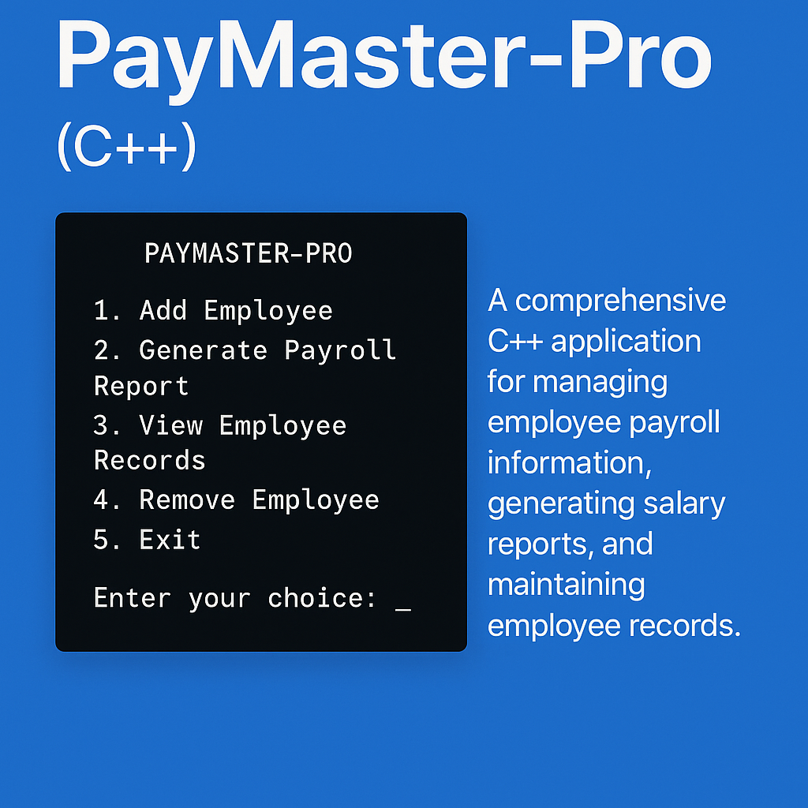

# PayMaster Pro - Modern Payroll Management System


A comprehensive C++ application for managing employee payroll information, generating salary reports, and maintaining employee records.

## Overview

PayMaster Pro is a modern, console-based payroll management system built with C++. It provides a user-friendly interface for managing employee information, calculating salaries, and generating reports. The system is designed to be efficient, reliable, and easy to use.

## Features

- **Employee Management**
  - Add new employees with detailed information
  - Modify existing employee records
  - Delete employee records
  - Display individual employee details
  - List all employees with key information

- **Payroll Processing**
  - Calculate salary based on employee grade and allowances
  - Generate salary slips for individual employees
  - Create comprehensive salary reports

- **Advanced Functionality**
  - Automatic calculation of allowances based on employee grade
  - Support for different types of allowances (House, Conveyance)
  - Loan management with automatic deduction calculation
  - Data persistence through file storage

## Technical Details

### Architecture

The project follows modern C++ best practices with a modular, object-oriented design:

- **Separation of Concerns**: The codebase is organized into distinct modules, each with a specific responsibility.
- **Encapsulation**: Classes hide implementation details and expose only necessary interfaces.
- **Error Handling**: Robust validation and error handling throughout the application.
- **File I/O**: Binary file operations for efficient data storage and retrieval.

### Project Structure

- **Employee Class**: Represents an employee with all relevant attributes and methods.
- **EmployeeManager Class**: Manages the collection of employees and provides operations on them.
- **Utility Functions**: Common functions for UI, input validation, and other shared functionality.
- **Main Application**: Ties everything together with a user-friendly menu system.

### C++ Concepts Used

- Classes and Objects
- Inheritance and Composition
- File Handling (Binary I/O)
- Templates
- STL Containers (vectors)
- Lambda Expressions
- Modern C++ Features
- Exception Handling
- Smart Pointers
- Namespaces

## Use Cases

### Human Resources Department

HR personnel can use PayMaster Pro to:
- Maintain a comprehensive database of all employees
- Quickly access employee information when needed
- Process new hires by adding them to the system
- Update employee information when changes occur
- Remove employees who have left the organization

### Finance Department

Finance teams can use PayMaster Pro to:
- Generate salary reports for accounting purposes
- Calculate payroll expenses for budgeting
- Track loans given to employees
- Process monthly salary calculations
- Generate individual salary slips

### Management

Managers can use PayMaster Pro to:
- Get an overview of all employees in the organization
- Review salary expenses across different departments
- Make informed decisions about salary structures
- Monitor loan disbursements and repayments

## Getting Started

### Prerequisites

- C++ compiler with C++11 support or higher
- Windows operating system (for console UI functions)

### Compilation

To compile the project, use the following command:

```bash
g++ -std=c++11 main.cpp Employee.cpp EmployeeManager.cpp Utility.cpp -o PayMasterPro
```

### Running the Application

After compilation, run the executable:

```bash
./PayMasterPro
```

## License

This project is licensed under the MIT License - see the [LICENSE](LICENSE) file for details.

Copyright (c) 2025 Mhd Ayham Joumran

## Contributing

Contributions are welcome! Please feel free to submit a Pull Request.
